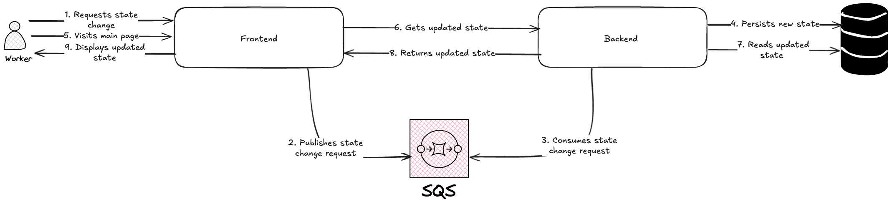

# Equipment monitoring system

This is a simple equipment monitoring system that allows workers to request changes in the state of 
certain equipments through a web interface.

## Components

The system is composed of the following components:
1. A web interface that enables workers to monitor the current status of the equipment, request modifications, and review the history of changes.
2. A queue that handles incoming requests for equipment state changes.
3. A backend that processes these requests, updates the equipment accordingly and exposes the data to the web interface through a REST API.
4. A database that maintains both the current state of the equipment and the history of changes made.

## Flow diagram

The flow diagram below shows the scenario where a worker requests a change in the state of equipment through the web interface.



## Getting started

### Prerequisites

To run the system, you need to have the following software installed on your machine:
1. [Docker](https://www.docker.com/)
2. [Docker Compose](https://docs.docker.com/compose/)
3. [Node.js](https://nodejs.org/)
4. [NPM](https://www.npmjs.com/)
5. [.NET version 9](https://dotnet.microsoft.com/download/dotnet/9.0)

### Running the application

To run the application, follow the steps below:

1. Start the database and the queue with docker compose:
    ```bash
    docker-compose up -d db queue
    ```

2. Start the backend in the `backend` directory:
    ```bash
    dotnet run --project src/Api/
    ```
   
3. In a new terminal session start the web interface in the `frontend` directory:
    ```bash
   npm run dev
    ```
   
4. Access the web interface at `http://localhost:3000`.

